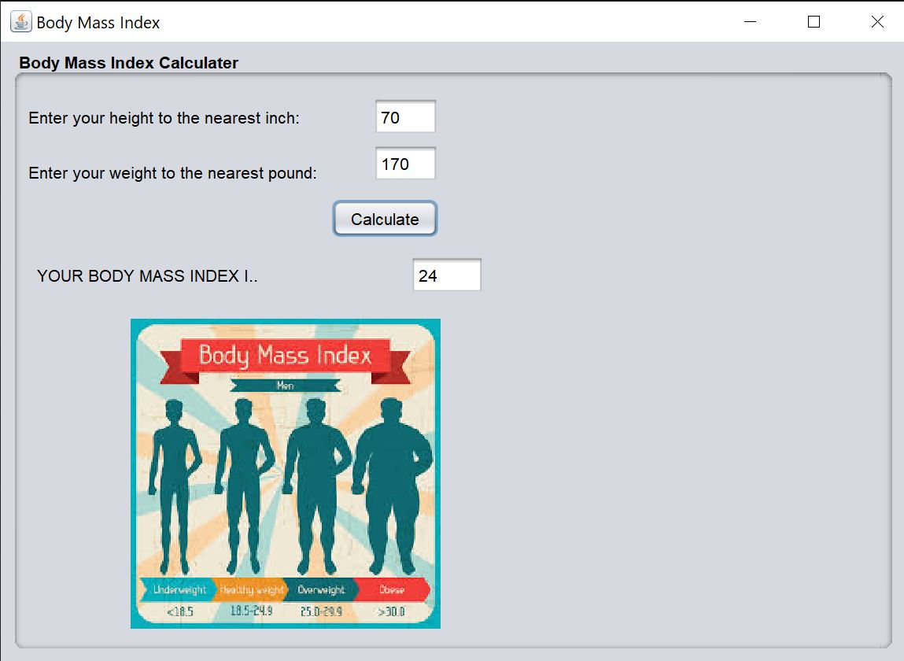

# BMI Calculator

This application features a simple GUI interface that allows users to determine their Body Mass Index using their height (in inches) and weight (in pounds). Equally important to mention, this program was developed using Java, while capitalising on its javax.swing library to create a simple GUI. Below is a screenshot of the program.

This program can be run using the BMI.java file in the src folder.
